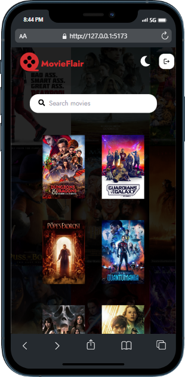

# MovieFlair App

This is a web application built using React.js, Tailwind CSS, Axios,Framer motion, React Icons, React Spinner, and The Movie DB API. The app allows users to search for movies

## Screenshots



## Features

- Search for movies, TV shows, and actors/actresses
- Filter search results by popularity, rating, and release date
- Display of loading spinner while data is being fetched
- Responsive design using Tailwind CSS
- Better animation using Framer motion

## Technologies Used

- React.js
- Tailwind CSS
- Axios
- React Icons
- React Spinner
- Framer Motion
- The Movie DB API

Open your browser and visit `https://b2jz31-5173.csb.app/` to access the application.

## Acknowledgments

This app was built as a project for learning React.js, Tailwind CSS, Axios, and working with API data. The Movie DB API was used for fetching movie, TV show, and actor/actress data.

## API Reference

To use this app, simply clone the repository and install the necessary dependencies using `npm install`. You will also need to obtain an API key from The Movie DB API website and update the `home.jsx`

_API_KEY_ variable set your API key. Once the dependencies have been installed and the API key has been updated, you can start the development server by running `npm start`.

## Installation

Clone the repository : https://github.com/daaniissh/MovieFlair.git

```bash
  npm install my-project
  cd my-project
```
